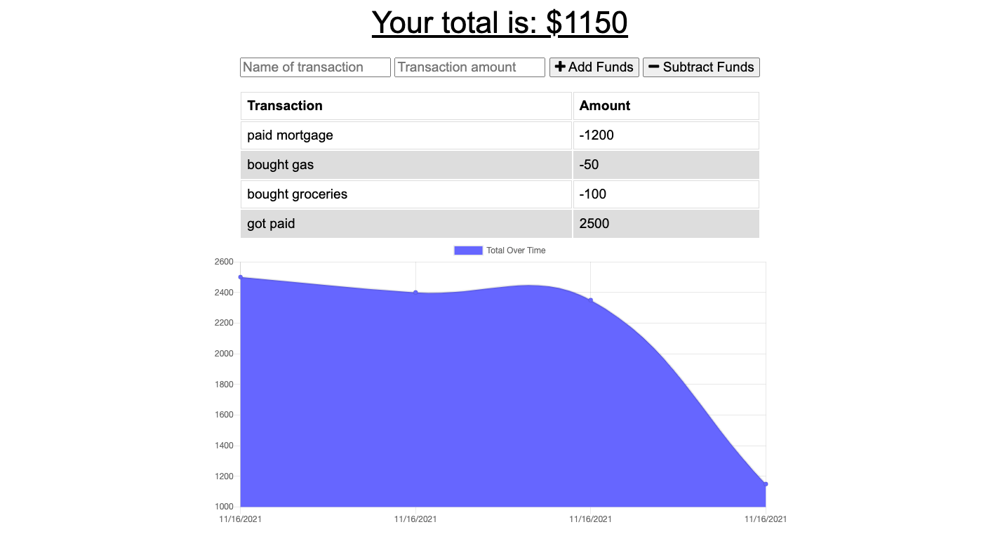

# homework-19
# Budget Tracker

### The assignment was to update the budget tracker that had been the mini-project assignment in Section 18 to be able to work offline, and then update when brought back online. 

## Packages, APIs, etc.
### Compression, express, lite-server, mongoose, and morgan were installed. To deploy on Heroku, the server was connected thought MongoDB Atlas. 

## Contributions
### We were given starter code. Work in the service-worker.js and manifest.json file were referenced from the class activities. The db.js file was the same file from the mini-project in section 18 this assignment was based on. I got some help from my tutor, Ben Abbott, and Chuck Stephens found a bug for me. Didn't get any help from anyone else, but did help a few other classmates with this assignment. 

## The applicaiton has a MIT License. 

[The application is deployed here](https://hw19budgettracker.herokuapp.com/)

